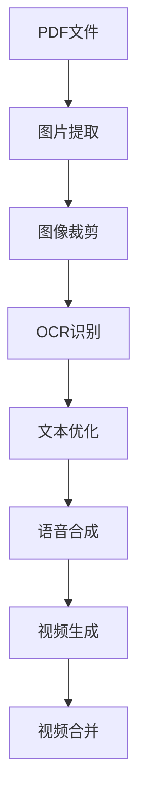

```markdown
# AI Comic to Video Processor 🎞️📚

将漫画PDF自动转换为有声视频的AI处理工具

[](https://www.python.org/)
[](LICENSE)

## 功能特点 ✨

- **全自动处理流程**：从PDF到视频的一站式解决方案
- **智能文本处理**：结合OCR识别与通义千问大模型优化文本
- **多模态生成**：文本转语音 + 图像动画合成
- **智能编排**：自动添加转场效果与音画同步
- **批量处理**：支持多章节PDF的连续处理

## 处理流程 🔄



## 快速开始 🚀

### 环境要求

- Python 3.8+
- NVIDIA GPU (推荐)
- FFmpeg 5.0+

### 安装依赖

```bash
pip install -r requirements.txt
```

### 配置文件

在`config.py`中添加API密钥：
```python
ALIYUN_API_KEY = "your_aliyun_key"
FISH_AUDIO_KEY = "your_fish_audio_key"
```

## 使用教程 📖

### 1. PDF转图片
```bash
python pdf_to_images.py --input comic.pdf --output ./frames
```

### 2. 启动全流程处理
```bash
逐步启动
```

### 参数说明
| 参数 | 说明 | 默认值 |
|------|------|--------|
| `--input-dir` | 输入图片目录 | 必填 |
| `--output-dir` | 输出目录 | `./output` |
| `--resolution` | 输出分辨率 | `1920x1080` |
| `--fps` | 视频帧率 | `24` |
| `--voice` | 语音角色 | `female_01` |

## 技术架构 🛠️

### 核心组件
- **PDF解析**：PyMuPDF
- **图像处理**：OpenCV + Pillow
- **OCR引擎**：EasyOCR
- **文本优化**：通义千问大模型
- **语音合成**：FishAudio SDK
- **视频合成**：FFmpeg + 自定义转场

### 性能优化
- 多进程批处理
- CUDA加速推理
- 显存优化策略
- 智能缓存机制

## 常见问题 ❓

### Q1: 处理过程中显存不足？
- 减小批处理大小 (`--batch-size 2`)
- 使用`--half-precision`启用半精度模式
- 关闭预览模式 (`--disable-preview`)


## 贡献指南 🤝

欢迎提交Issue和PR！请遵循以下规范：
- 使用`pre-commit`进行代码校验
- 提交前运行测试套件
- 保持API兼容性

## 许可证 📄

本项目采用 [MIT License](LICENSE)

---

**提示**：首次使用前请确保：
1. 已申请阿里云和FishAudio的API密钥
2. FFmpeg已加入系统PATH
3. 至少5GB可用存储空间（处理100页PDF约需3GB）
```
